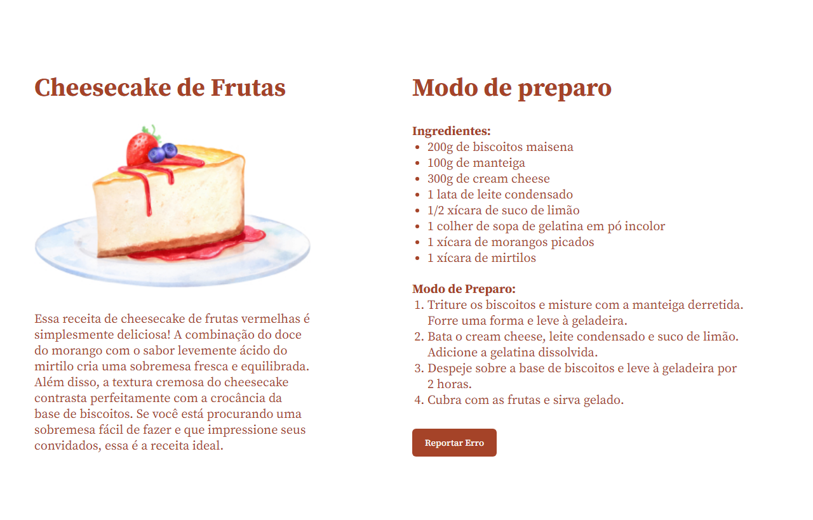

# Projeto Cheesecake do curso Explorer da Rocketseat

    
    
    

Este projeto é uma página de receita para um delicioso Cheesecake de Frutas Vermelhas. A receita apresenta uma combinação de sabores frescos e equilibrados, ideal para impressionar seus convidados.

## :exclamation: Pré-requisitos

Navegador web moderno

## :hammer: Intalação

1. Clone o repositório: git clone https://github.com/Raissa-Cardoso/XR-Cheesecake.git
2. Abra o arquivo `index.html` em seu navegador web.

## :computer: Uso

Após abrir o arquivo `index.html` em seu navegador, você verá uma página de receita detalhada para um Cheesecake de Frutas Vermelhas, incluindo ingredientes, modo de preparo e uma imagem ilustrativa.

## :star: Tecnologias utilizadas

- **`HTML`**
- **`CSS`**
